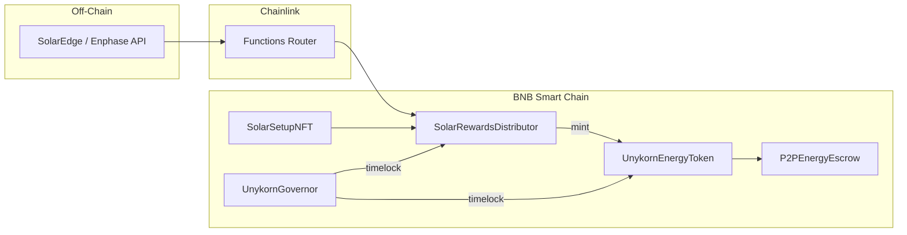

<div align="center">

# 🦄 FTHTrading · Energy-Token

### Verifiable DePIN Solar Infrastructure · P2P Energy Escrow · DAO Governance

[](https://soliditylang.org/)
[](https://book.getfoundry.sh/)
[](https://testnet.bnbchain.org/)
[](https://chain.link/)
[](https://github.com/FTHTrading/Energy-Token)
[](https://github.com/FTHTrading/Energy-Token)

**[Repository](https://github.com/FTHTrading/Energy-Token)** · **[Whitepaper](marketing-and-docs/WHITEPAPER.md)** · **[BNB Deploy Guide](marketing-and-docs/DEPLOYMENT_BNB_TESTNET.md)** · **[Frontend](frontend/)**

</div>

---

## 📑 Table of Contents

| | | |
|:---|:---|:---|
| [Overview](#-overview) | [Architecture Map](#-architecture-map) | [Repository Layout](#-repository-layout) |
| [Tokenomics](#-tokenomics) | [System Layers](#-system-layers) | [Smart Contracts](#-smart-contracts) |
| [Data Flow](#-data-flow) | [Developer Setup](#-developer-setup) | [BNB Testnet Deploy](#-bnb-testnet-deployment) |
| [Testing](#-testing) | [Security Model](#-security-model) | [Roadmap](#-roadmap) |

---

## 🌐 Overview

**Unykorn Energy Token (UNYE)** is a verifiable DePIN asset for decentralized solar infrastructure. Unlike manually-minted template tokens, UNYE mints **only when Chainlink Functions confirms real kWh production** from registered inverter hardware.

| Capability | Description |
|:-----------|:------------|
| **Verifiable minting** | 1 UNYE per 5 kWh — oracle-gated, capped at 250M |
| **Hardware registry** | UNY-SOLAR NFTs tie token IDs to SolarEdge / Enphase setups |
| **P2P trading** | Escrow locks UNYE until buyer confirms kWh delivery |
| **DAO control** | Governor + 48h timelock — no lingering admin keys post-deploy |

---

## 🎨 Architecture Map

| Layer | Badge | Component | Path | Responsibility |
|:------|:------|:----------|:-----|:---------------|
| **Core Economy** |  | Energy Token | [`contracts/src/UnykornEnergyToken.sol`](contracts/src/UnykornEnergyToken.sol) | 250M cap ERC20, UUPS, transfer tax, votes |
| **DePIN Registry** |  | Solar Setup NFT | [`contracts/src/SolarSetupNFT.sol`](contracts/src/SolarSetupNFT.sol) | Inverter metadata & ownership gating |
| **Oracle Rewards** |  | Rewards Distributor | [`contracts/src/SolarRewardsDistributor.sol`](contracts/src/SolarRewardsDistributor.sol) | kWh verification + dynamic mint |
| **P2P Escrow** |  | Energy Escrow | [`contracts/src/P2PEnergyEscrow.sol`](contracts/src/P2PEnergyEscrow.sol) | Local energy marketplace |
| **Governance** |  | Governor + Timelock | [`UnykornGovernor.sol`](contracts/src/UnykornGovernor.sol) · [`UnykornTimelock.sol`](contracts/src/UnykornTimelock.sol) | Proposals, voting, delayed execution |



---

## 📂 Repository Layout

```
Energy-Token/
├── contracts/
│   ├── src/                    # 6 core Solidity contracts
│   ├── script/Deploy.s.sol     # Full deploy + DAO handoff
│   ├── test/                   # 9 Foundry tests (all passing)
│   ├── install-deps.ps1        # One-shot clone bootstrap
│   └── foundry.toml
├── oracle-telemetry/
│   └── mock-inverter.js        # Local telemetry simulator
├── marketing-and-docs/
│   ├── WHITEPAPER.md
│   ├── DEPLOYMENT_BNB_TESTNET.md
│   └── social-campaigns/       # Launch kit
└── frontend/                   # Next.js branded docs shell
```

---

## 💰 Tokenomics

| Parameter | Value | Detail |
|:----------|:------|:-------|
| **Symbol** | `UNYE` | Unykorn Energy Token |
| **Max Supply** | `250,000,000` | Hardcoded ceiling |
| **Genesis Mint** | `50,000,000` (20%) | Treasury — liquidity & marketing |
| **Dynamic Mint** | `1 UNYE / 5 kWh` | Only via verified distributor |
| **Transfer Tax** | `0% – 2%` | DAO-adjustable; system contracts exempt |
| **Proposal Threshold** | `1,000,000 UNYE` | Required to submit governance proposals |
| **Quorum** | `4%` | Of total vote supply |
| **Timelock Delay** | `48 hours` | Minimum execution delay |

---

## 🧱 System Layers

### 🟩 Layer 1 — Core Token (UNYE)

- UUPS-upgradeable OpenZeppelin ERC20 with `ERC20Votes`
- `_update` hook routes transfer tax to treasury (whitelist for escrow/distributor)
- `setDistributor()` binds mint authority to `SolarRewardsDistributor`

### 🟦 Layer 2 — DePIN Solar Registry (UNY-SOLAR)

```solidity
struct InverterMetadata {
    string inverterId;      // Serial / API registration ID
    string provider;        // "SolarEdge", "Enphase", etc.
    uint256 capacityWatts;
    uint256 registeredAt;
}
```

### 🟨 Layer 3 — Chainlink Oracle Rewards

- BNB testnet Functions router: `0x6E2dc0F9DB014aE19888F539E59285D2Ea04244C`
- `requestKWhVerification()` → Chainlink DON → `fulfillRequest()` → mint delta
- On-chain `claimedKWh` mapping prevents double-reward

### 🟧 Layer 4 — P2P Energy Escrow

1. Seller lists kWh + UNYE price (must own setup NFT)
2. Buyer locks tokens in escrow
3. Buyer confirms delivery → seller paid
4. Dispute → arbitrator resolves (refund or release)

### 🟪 Layer 5 — DAO Governance

- `UnykornGovernor` — proposals, counting, execution queue
- `UnykornTimelock` — 172,800s delay; ownership transferred at deploy
- Post-deploy: token, NFT, distributor, escrow owned by timelock

---

## 📜 Smart Contracts

| Contract | Type | Key Features |
|:---------|:-----|:-------------|
| `UnykornEnergyToken.sol` | ERC20 + Votes + UUPS | 250M cap, tax, distributor mint |
| `SolarSetupNFT.sol` | ERC721 + UUPS | Hardware proof registry |
| `SolarRewardsDistributor.sol` | Chainlink Client + UUPS | kWh verify, reward rate |
| `P2PEnergyEscrow.sol` | Escrow + UUPS | Offers, fill, confirm, dispute |
| `UnykornGovernor.sol` | OZ Governor v5 | Proposal lifecycle |
| `UnykornTimelock.sol` | OZ TimelockController | Delayed execution |

---

## 🔄 Data Flow

```
Inverter API → Chainlink Functions → SolarRewardsDistributor
                                              ↓
SolarSetupNFT (ownership check) ──────→ mint UNYE → Treasury / Holders
                                              ↓
                                    P2PEnergyEscrow (optional P2P)
```

---

## 🛠 Developer Setup

### Prerequisites

- [Foundry](https://book.getfoundry.sh/getting-started/installation)
- Node.js 20+ (OpenZeppelin + Chainlink npm deps)

### Clone & Build

```bash
git clone https://github.com/FTHTrading/Energy-Token.git
cd Energy-Token/contracts

# If forge-std is incomplete after clone:
forge install foundry-rs/forge-std --no-commit
# Or on Windows:
# .\install-deps.ps1

npm install
forge build
forge test -vvv
```

### Frontend

```bash
cd ../frontend
npm install
npm run dev
# → http://localhost:3000
```

---

## 🚀 BNB Testnet Deployment

| Item | Value |
|:-----|:------|
| Chain ID | `97` |
| RPC | `https://data-seed-prebsc-1-s1.binance.org:8545` |
| Est. gas cost | **~0.002 BNB** |
| Faucet | https://testnet.bnbchain.org/faucet-smart |

```powershell
cd contracts
$env:PRIVATE_KEY = "<DEPLOYER_KEY>"
$env:TREASURY_ADDRESS = "<TREASURY>"
$env:ARBITRATOR_ADDRESS = "<ARBITRATOR>"
$env:CHAINLINK_SUB_ID = "1"

forge script script/Deploy.s.sol `
  --rpc-url https://data-seed-prebsc-1-s1.binance.org:8545 `
  --broadcast --verify
```

See [`marketing-and-docs/DEPLOYMENT_BNB_TESTNET.md`](marketing-and-docs/DEPLOYMENT_BNB_TESTNET.md) for verification scripts and launch kit.

---

## ✅ Testing

| Suite | Count | Command |
|:------|:------|:--------|
| Token economics | 3 | `test_InitialSupply`, tax, exemption |
| NFT registry | 2 | register, duplicate guard |
| Distributor | 2 | config, ownership gate |
| P2P escrow | 2 | full trade flow, dispute refund |

```bash
cd contracts && forge test -vvv
# 9 tests, 0 failures
```

---

## 🔒 Security Model

| Control | Implementation |
|:--------|:---------------|
| Mint authority | Only `SolarRewardsDistributor` after `setDistributor()` |
| Upgrade path | UUPS — timelock-owned post-deploy |
| Tax bypass | Explicit whitelist for system contracts |
| Governance lag | 48h timelock on all parameter changes |
| Oracle trust | Chainlink DON — no manual ECDSA admin mint |

---

## 🗺 Roadmap

| Phase | Milestone | Status |
|:------|:----------|:-------|
| **I** | Contracts + 9 tests | ✅ Complete |
| **II** | BNB testnet broadcast + verify | ⏳ Awaiting tBNB faucet |
| **III** | Frontend wallet connect (wagmi) | 🔜 Scaffold live |
| **IV** | Mainnet + Chainlink subscription | 📋 Planned |
| **V** | Georgia installer pilot outreach | 📋 Launch kit ready |

---

<div align="center">

**Built by [FTHTrading](https://github.com/FTHTrading)** · Copyright © 2026

*Real watts. Verified on-chain. Governed by holders.*

</div>
